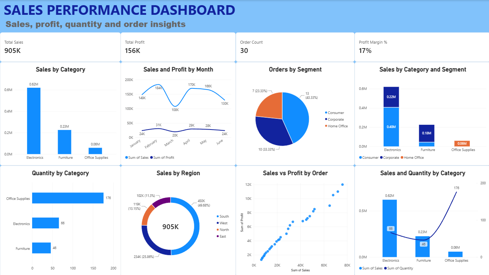

# Sales Performance Dashboard — Power BI

## 📊 Project Overview

An interactive Power BI dashboard developed to analyze sales performance and identify trends across different business dimensions.

## 📊 Dashboard Preview

## 📌 Key Metrics

- **Total Sales:** 905K
- **Total Profit:** 156K
- **Order Count:** 30
- **Profit Margin:** 17%

## 📈 Analysis Covered

- Sales by Category
- Sales and Profit by Month
- Orders by Segment
- Sales by Category and Segment
- Quantity by Category
- Sales by Region
- Sales vs Profit by Order

## 🛠️ Tools Used

- Microsoft Power BI
- Data Analysis
- Data Visualization
- Power BI Charts and KPI Cards

## 🎯 Key Objective

To transform sales data into an interactive dashboard that makes it easier to understand sales trends, profitability, product categories, customer segments, and regional performance.
